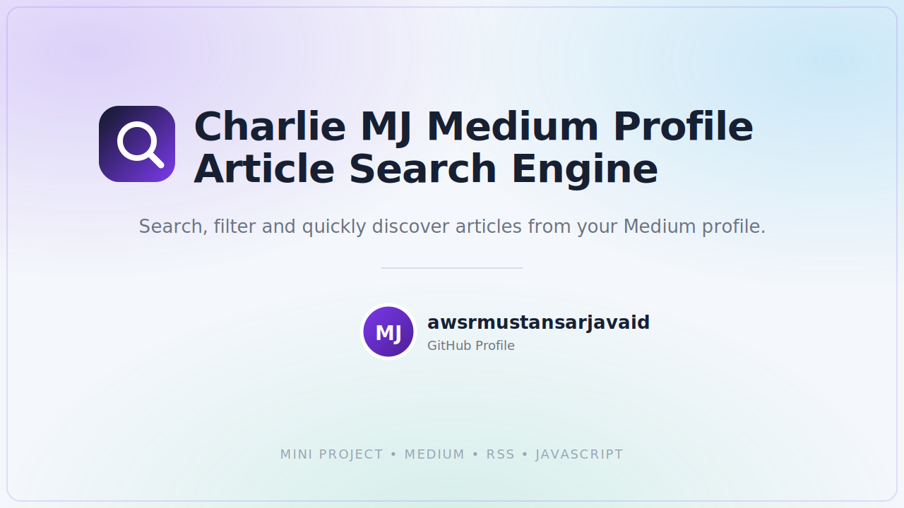

# Charlie MJ Medium Profile Article Search Engine



A lightweight, single-file web app that lets you search, filter, and browse articles from any public Medium profile — with live keyword highlighting, cover images, sorting, grid/list views, and dark mode. No backend, no build step, no dependencies to install. Just open the HTML file and go.

🔗 **Live demo:** *([🚀 𝗕𝘂𝗶𝗹𝘁 𝗮 𝗺𝗶𝗻𝗶 𝘀𝗶𝗱𝗲 𝗽𝗿𝗼𝗷𝗲𝗰𝘁: 𝗠𝗲𝗱𝗶𝘂𝗺 𝗣𝗿𝗼𝗳𝗶𝗹𝗲 𝗔𝗿𝘁𝗶𝗰𝗹𝗲 𝗦𝗲𝗮𝗿𝗰𝗵 𝗘𝗻𝗴𝗶𝗻𝗲](https://lnkd.in/p/dUpZr6xE))*

---

## 📖 Why I Built This

I write on Medium regularly, and I kept running into the same annoyance: Medium's own profile page doesn't let you search your own articles by keyword or filter them the way you'd want. If I wanted to find every article where I mentioned a specific word — a language, a topic, a phrase — I had to scroll and read titles manually.

So I built a small, focused tool that:
- Pulls articles directly from any public Medium profile,
- Lets you search by a main term and stack additional keyword filters on top,
- Visually highlights exactly where those matches occur,
- And shows everything in a clean, modern card layout with the article's real cover image.

It's a "mini project" in scope, but it solves a real, everyday problem — and it doubles as a practical example of working around real-world web constraints like CORS and RSS feed quirks.

---

## 🏗️ Architecture & Design

This project is intentionally a **single-page, client-side-only application** — everything (HTML, CSS, and JavaScript) lives in one `.html` file. There is no server, no database, and no build pipeline.

```
┌──────────────────────────┐
│   Browser (Client)       │
│                          │
│  ┌────────────────────┐  │
│  │  UI Layer          │  │   Bootstrap 5 + custom CSS
│  │  (HTML + CSS)      │  │   Search panel, cards, toolbar
│  └────────┬───────────┘  │
│           │              │
│  ┌────────▼───────────┐  │
│  │  App Logic         │  │   Vanilla JavaScript (ES6+)
│  │  (Vanilla JS)      │  │   State, filtering, rendering,
│  │                    │  │   sorting, theme, localStorage
│  └────────┬───────────┘  │
└───────────┼──────────────┘
            │  fetch()
            ▼
┌──────────────────────────┐
│   rss2json.com (Bridge)  │   Converts Medium's public RSS
│                          │   feed (XML) into browser-usable
└───────────┬──────────────┘   JSON (bypasses CORS)
            │
            ▼
┌──────────────────────────┐
│   Medium RSS Feed        │   https://medium.com/feed/@username
│   (Public, per-profile)  │
└──────────────────────────┘
```

### How it works, step by step

1. **User enters a Medium profile URL** (e.g. `https://medium.com/@username`).
2. The app builds the corresponding **public RSS feed URL** (`https://medium.com/feed/@username`).
3. Since browsers block direct cross-origin RSS/XML fetches from a static page (**CORS**), the app routes the request through **rss2json.com**, a free bridge service that converts the RSS/XML feed into JSON on the server side and returns it with CORS-friendly headers.
4. The returned JSON (an array of article objects — title, link, publish date, and content) is stored in memory as the app's in-page "database" (`allArticles`).
5. The **search term** and any **keyword chips** are applied as client-side filters against each article's title/content.
6. Matching text is **highlighted inline** — yellow for the main search term, green for keyword chips — using dynamically generated `<mark>`-style spans.
7. **Cover images** are resolved with a fallback chain, since Medium's feed doesn't always expose a clean `thumbnail` field:
   - `thumbnail` field (if present),
   - `enclosure.link` (if present),
   - otherwise, the first real `` found inside the article's HTML content — while skipping Medium's hidden 1×1 tracking-pixel image.
8. Results are **sorted** (newest, oldest, or title A–Z) and rendered as responsive cards, switchable between **grid** and **list** view.
9. The **Medium profile URL** and **dark/light theme preference** are persisted in `localStorage`, so returning users don't have to re-enter them.

### Why this architecture?

- **No backend needed** → the app is fully static and can be hosted for free on GitHub Pages, Netlify, or Vercel.
- **CORS-safe** → rss2json.com acts as a proxy so the browser never tries to fetch Medium's XML feed directly.
- **Progressive-friendly** → the code is structured so a real backend/archive index could later replace the rss2json call without touching the UI layer.
- **Zero install** → no `npm install`, no bundler, no framework — just open the file.

---

## ✨ Features

| Feature | Description |
|---|---|
| 🔍 Main search | Search article titles/content by a keyword, highlighted in yellow |
| 🏷️ Keyword chips | Add multiple extra filter keywords, highlighted in green |
| 🖼️ Cover images | Automatically resolves each article's real cover image |
| ↕️ Sorting | Sort results by newest, oldest, or title (A–Z) |
| 🔲 Grid / List view | Toggle between card grid and compact list layout |
| 🌗 Dark mode | One-click theme toggle, remembered across visits |
| 💾 Persisted profile | Your last-used Medium profile URL is remembered |
| 📱 Responsive UI | Built on Bootstrap 5, works on mobile, tablet, and desktop |
| ⚡ Zero backend | Pure static HTML/CSS/JS — deployable anywhere |

---

## 🛠️ Tech Stack

- **HTML5** — semantic page structure
- **CSS3** — custom properties (CSS variables) for theming, gradients, transitions, responsive layout
- **JavaScript (ES6+, Vanilla)** — no frameworks; uses `fetch`, template literals, array methods (`map`, `filter`, `sort`), regex for HTML parsing, and the DOM API directly
- **Bootstrap 5** — responsive grid, form components, utility classes
- **Bootstrap Icons** — icon set used throughout the UI
- **rss2json.com API** — third-party RSS-to-JSON conversion service, used as a CORS-friendly bridge to Medium's public feed
- **Medium RSS Feed** — the underlying public data source (`medium.com/feed/@username`)
- **Web Storage API (`localStorage`)** — client-side persistence for theme and profile URL

### Concepts demonstrated in this project

- **CORS (Cross-Origin Resource Sharing)** and why a browser-only app can't call arbitrary third-party APIs directly
- **RSS/XML-to-JSON bridging** as a pattern for consuming legacy feed formats in modern JS apps
- **Client-side filtering & search** without a database or backend
- **Regex-based HTML parsing** to recover data (cover images) that's embedded in feed content rather than in dedicated fields
- **State management in vanilla JS** (no framework) using simple module-level variables
- **`localStorage`** for lightweight persistence
- **Responsive, component-style CSS** using CSS custom properties for light/dark theming
- **Progressive enhancement mindset** — designed so the data source can be swapped later without a UI rewrite

---

## 🚀 Getting Started

No installation required.

1. Clone or download this repository.
2. Open `index.html` in any modern browser.
3. Enter a public Medium profile URL (e.g. `https://medium.com/@yourusername`).
4. Type a search term and/or add keyword filters, then click **Search Medium**.

Optionally, deploy it for free on **GitHub Pages**:
`Settings → Pages → Deploy from branch → main / root`

---

## ⚠️ Known Limitations

- Medium's public RSS feed typically exposes only the **10 most recent articles** per profile — this is a Medium limitation, not an app limitation.
- Relies on the free **rss2json.com** service, which has its own rate limits.
- Only works with **public** Medium profiles/articles.

---

## 👤 Author

**Raja Muhammad Mustansar Javaid**
GitHub: [awsrmmustansarjavaid](https://github.com/awsrmmustansarjavaid)

---

## 📄 License

This project is open source and available under the [MIT License](LICENSE).
